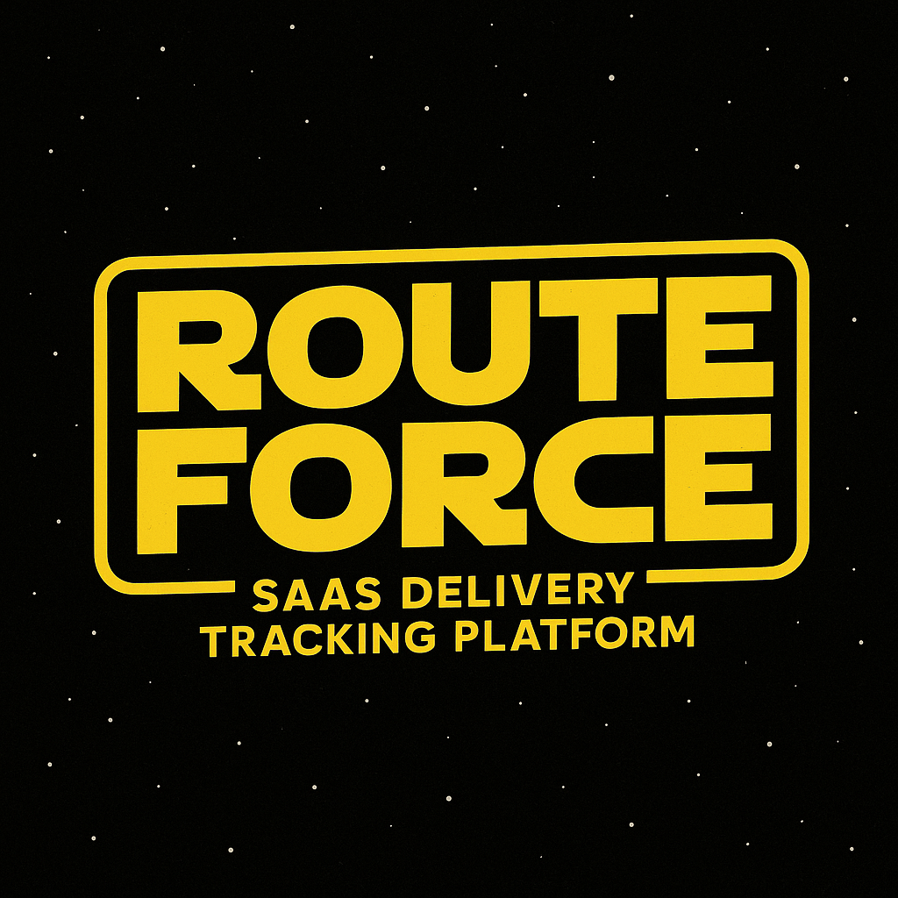

# Route Force



## Clean Architecture from Jason Taylor
reference: https://github.com/jasontaylordev/CleanArchitecture
- Minimal API:

Core Application:
``` 
Dotnet Version: >=8.0.4
Dotnet EF Tool: =9.0.0


Development:
Node : >= v22.19.0
Just (Optional)
```

External:
```
Mailpit: docker run -d --restart unless-stopped --name=mailpit -p 8025:8025 -p 1025:1025 axllent/mailpit
```


## Front End

- DAISY UI: tailwindcss, pre-build components
> reference: https://daisyui.com/
- HTMX: simplicity, mimic SPA framework but wait simpler
> reference: https://htmx.org/
- Blazor Template: for Server Side page creation with easy to use template
in Minimal API architecure it allow to return RazorComponentResult as a html response
is the main enabler for simple tech tack of Minimal API and HTMX
> reference: https://learn.microsoft.com/en-us/dotnet/api/microsoft.aspnetcore.http.httpresults.razorcomponentresult?view=aspnetcore-9.0

> https://dotnet.microsoft.com/en-us/apps/aspnet/web-apps/blazor

- Google Map API for location suggestion

## Code Architecture & Patterns

- Cookies Authentication - which is suitable for HTMX and SSR application
- Optional Pattern

## How to Start 

```sh
# Create DB with migrations
dotnet ef database update --project src/RouteForce.Infrastructure --startup-project src/RouteForce.Web

# Start
dotnet run --environment Production --project src/RouteForce.Web
OR
just prod
```